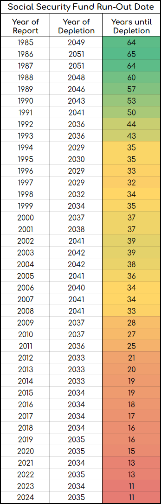

# FixSocialSecurity
If you read the reports, it seems like the doom date for social security is always just a little bit away.. But if you chart those dates, since the committee started tracking them, you get a very different picture, and a much more realistic view of the crisis looming ahead:

## References
1. [2024 OASDI Trustees Report](https://www.ssa.gov/oact/TR/2024/index.html)
